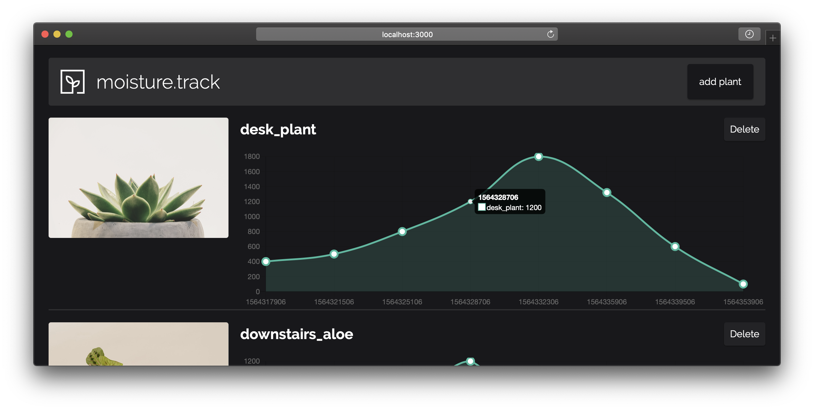

# moisture.track

Plant moisture tracker and visualiser.




## Hardware

* https://thepihut.com/products/adafruit-stemma-soil-sensor-i2c-capacitive-moisture-sensor-ada4026
* https://thepihut.com/products/adafruit-jst-ph-4-pin-to-female-socket-cable-i2c-stemma-cable-200mm-ada3950?variant=18634586259518
* RPi Zero W.

## Software

### Moisture monitor

UUID for plant hard-coded.  
Moisture sensor returns 200 (very dry) to 2000 (very wet) over i^2c.

---

### Front-end

React, Redux, styled-components, chartjs  
Support for several plants.

Point graph style representation of moisture as a function of time.

* Plant graph view

---

## API ✅

Python3.6 Flask CRUD

`pipenv run heroku local`

`cd api/ && flask run`

```json
{
	"_id": "d8163995-3b9f-4cc5-bbeb-d12522964f16",
	"name": "desk_plant",
	"date_added": 1364251214,
	"updates": {
		"1364251214": 313,
		"1364251216": 223,
		"1364251229": 196,
	}
}
```

### Useage

All responses will be of the form:

```json
{
	"data": "Mixed data type holding the content of the response",
	"message": "Message describing what just happened"
}
```

#### List all plants

`GET /plants` 200 (OK)

```json
[
  {
    "_id": {
      "$oid": "5d3dc23397873ed681db7e6a"
    },
    "plant_name": "desk_plant",
    "date_added": 1564328499,
    "image_url": "https://i.imgur.com/JYdAD9Y.jpg",
    "updates": {
      "1564317906": "400",
      "1564321506": "500",
      "1564325106": "800"
    }
  }
]
```

#### Create a new plant

`POST /plants` 201 (Created)

* `"name"`: string, **required**
* `"image_url"`: string


```json
{
	"name": "desk_plant",
	"image_url": "https://imgur.com/ahgjasd.png"
}
```

Returns:

```json
{
  "message": {
    "_id": "5d3dfaa9a60c48701385be48"
  }
}
```


#### Get a specific plant

`GET /plants/<string:uuid>` 200 (OK)

#### Add a moisture level

`PUT /plants/<string:uuid>` 201 (Created)

```json
{
	"moisture_level": "1280"
}
```

#### Delete a plant

`DELETE /plants/<string:uuid>` 200 (OK)
